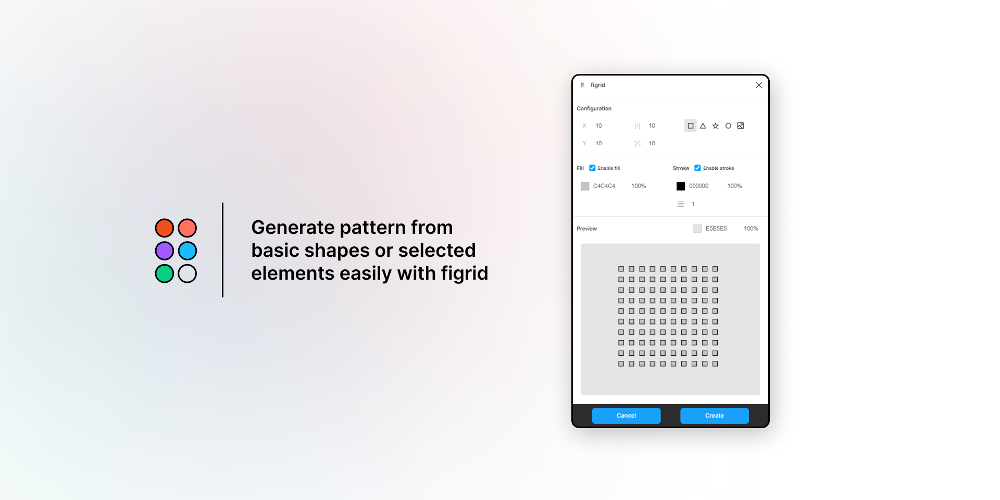

**figrid is an advanced plugin for creating grids from basic figma elements. Powerful and simple.**

## About

This plugin makes creating grids easy. You just have to fill required data. Everything is previewed below, so you can see much about how is your grid looking.

## Fields

To create grid you just have to fill the following fields and click `Create` button:

- `X` takes the number of elements on the X axis.
- `Y` takes the number of elements on the Y axis
- `Size` size of a single element, in plugin it is represented by icon.
- `Gap` gap between the elements, in plugin if is represented by icon.
- `Fill` hexadecimal color and opacity of elements\` fill.
- `Stroke` hexadecimal color and opacity of elements\` stroke.

You can also set the background color of the preview canvas to see what your mesh looks like on a specific color.
